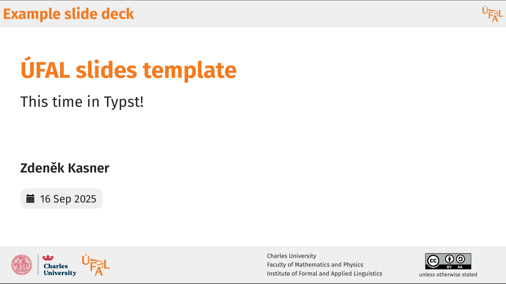
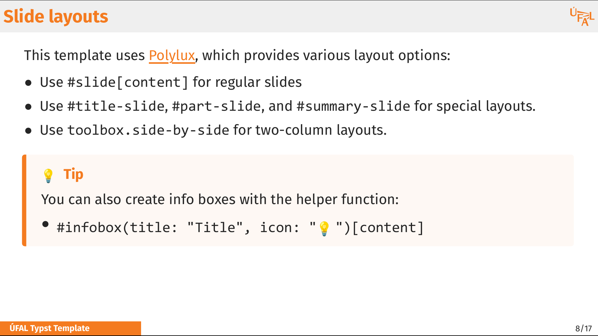

# ÚFAL Typst Template

A slide template for ÚFAL presentations with [Typst](https://typst.app/) and [Polylux](https://sitandr.github.io/polylux/book/polylux.html).

Inspired by  Jindřich Libovický's [ÚFAL Google Slides template](https://docs.google.com/presentation/d/1cE1fyaG9qWXJo5Upzi_i8mXMqUGbuYDgwqvHGYRgBSE/edit?usp=sharing) and Milan Straka's [SliMD template](https://github.com/ufal/slimd).

See also 👉️ **[ÚFAL Marp template](https://github.com/kasnerz/marp-ufal)**.


<p>


</p>


## Main Features

* **Easy editing**: Create slides using Typst's markup syntax with live preview.
* **Advanced layout:** Leverage Typst's powerful layout system.
* **Consistency:** Everything is nicely aligned out of the box.
* **Git-friendly**: You can version-control your presentations.
* **Mathematical typesetting**: Native support for math typesetting.
* **Auto footer**: No more manual copying of the bottom orange bar 💪
* **Popular framework**:  Typst has [excellent documentation](https://typst.app/docs/) and many extensions.

## Typst vs Marp ⚔️

Should I use the **Typst template** (this one) or the [Marp template](https://github.com/kasnerz/marp-ufal)?

| Typst                               | Marp                                  |
| ----------------------------------- | ------------------------------------- |
| ✅ Nicer markup language             | ✅ Simpler markup language             |
| ✅ More powerful layout handling     | ✅ Interactive content (video, audio)  |
| ✅ Online collaboration              | ❌ Need to use HTML for advanced stuff |
| ❌ PDF-only - no interactive content |                                       |

## Quickstart

### Using VS Code

1. **Install Typst LSP extension**:
   - Install [TinyMist Typst extension](https://marketplace.visualstudio.com/items?itemName=myriad-dreamin.tinymist) for VS Code

2. **Clone the template**:
   ```bash
   git clone https://github.com/kasnerz/typst-slides-ufal.git
   ```
3. **Install the fonts (if you don't have them yet):**
   - See `fonts/Fira Sans` and `fonts/Consolas`.

4. **Create your slides**:
   - Copy `slides-example.typ` as a starting point
   - Edit in VS Code with live preview
   - Export using Ctrl+Shift+P → "Typst: Export the Opened File as PDF"

### Using Command Line

1. **Install Typst**:
   ```bash
   # Using cargo
   cargo install --git https://github.com/typst/typst
   
   # Or download from GitHub releases
   ```

2. **Clone the template**:
   ```bash
   git clone https://github.com/kasnerz/typst-slides-ufal.git
   ```

3. **Start development**:
   ```bash
   # Watch for changes and auto-compile
   typst watch slides-example.typ presentation.pdf
   ```

4. **Export slides**:
   ```bash
   # Export to PDF
   typst compile slides-example.typ presentation.pdf
   
   # Export to PNG (all slides)
   typst compile slides-example.typ presentation.png
   ```

## Slide types

- `title-slide` - Title slide with ÚFAL branding
- `part-slide` - Section divider slides
- `summary-slide` - Final slide with boxed content
- `blank-slide` - Clean layout without header/footer

## Quick reference

### Basic Slide Structure
```typst
#import "ufal.typ": *

#show: ufal-theme.with(
  footer-content: "Your Presentation"
)

// Title slide
#title-slide(
  title: "Your Presentation Title",
  name: "Main Title",
  subtitle: "Your Subtitle", 
  author: "Your Name",
  date: "Date",
  langtech: false,  // Add LangTech/OPVV logos
  license-type: "cc-by-sa"  // or "cc-by-nc-sa"
)

// Section divider
#part-slide("Section Title")

// Regular slide
#slide[
= Slide Title


]
```

### Images
```typst
#image("image.png", width: 8cm)
#image("image.png", height: 5cm)

// With alignment
#align(center)[
  #image("image.png", width: 8cm)
]
```

### Math
```typst
Inline math: $E = mc^2$

Display math:
$$ integral_0^infinity e^(-x^2) dif x = sqrt(pi)/2 $$
```

## Contributing

Contributions are welcome! 🫵

## Resources

- [Typst Documentation](https://typst.app/docs/)
- [Polylux Documentation](https://sitandr.github.io/polylux/book/polylux.html)
- [Typst Community Discord](https://discord.gg/2uDybryKPe)
- [ÚFAL Marp Template](https://github.com/kasnerz/marp-ufal)
- [Original ÚFAL Google Slides Template](https://docs.google.com/presentation/d/1cE1fyaG9qWXJo5Upzi_i8mXMqUGbuYDgwqvHGYRgBSE/edit?usp=sharing)
